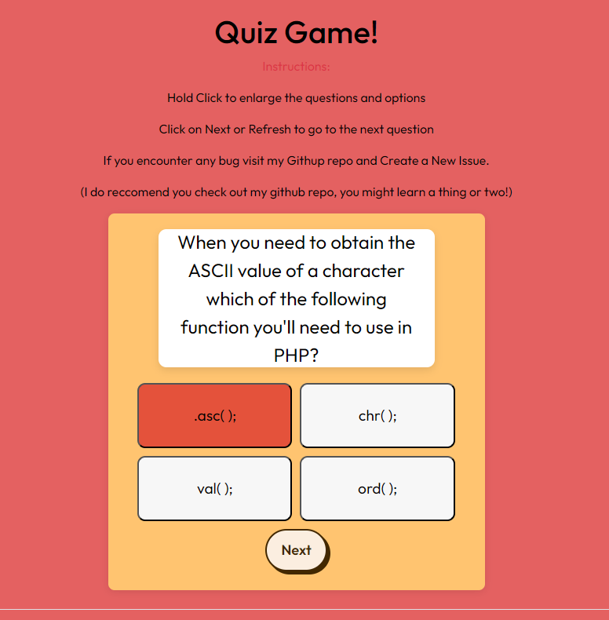
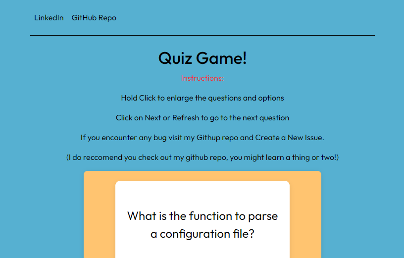

# Quiz Flash Card - README

Welcome to the **Quiz Game!** website! This project is designed to help you sharpen your computer science knowledge through an aestethitically pleasing-style quiz. It’s simple, interactive, and a great tool for learning.

## How It Works

- This quiz fetches random computer science-related questions from a JSON file.
- You’ll be presented with one question and multiple choice options. Simply click on the answer you think is correct.
- Hold any question or option for over 1 second to trigger a popup that shows the full text.
- After making a selection, the quiz will highlight your choice:
  - **Green**: Correct answer.
  - **Red**: Wrong answer.
- Once answered, you can click the "Next" button to refresh and load the next question.

## Features

- Clean and simple interface for effective learning.
- Uses basic HTML, CSS, and JavaScript along with jQuery for DOM manipulation.
  

## Development Story

This project took approximately **15 hours** of actual coding, starting at **4:00 AM** and finishing at around **8:00 PM** the same day. The day before was sspent researching the best ways to implement key features for approximately **2-3 hours!**

### Initial Plan vs. Reality

Initially, the plan was to build everything from scratch without using any frameworks like jQuery or Bootstrap. The intention was to keep the project lightweight and minimal. However, as the complexity of handling the quiz logic and DOM manipulation grew, the project had to be rewritten from scratch using **jQuery**. This was a necessary change to ensure the app's smooth functionality and maintainability.

Slow and Gradual but Consistent progress is far superior than Fast, Rapid and unreliable progress. I will be updating this in the coming days and the progress will be slow due to my college, but I will try my best to release the stable version soon. If this gains attention and people find this proof of concepts usefull, then I will make a better version with actual and useful KTU Questions, Short revision notes etc.

### Future Improvements

If this project gains traction and people find it useful, I plan to release a **better version** after the last stable release. The future version will include:

- **KTU / University Questions**
- More questions.
- Difficulty, Topic, Question type (MCQ) filters
- Explaination and Hints to every questions.
- User Contributed Questions.
- Professional database systems (RDBMS/DBMS) to handle data more efficiently.
- A dedicated domain and hosting service.
- Enhanced user experience and more sophisticated features.

_Note: Even if I made up my mind to create these, these might take a while due to time constrains._

## Feedback & Suggestions

All suggestions and questions are **highly encouraged**! You can reach out via:

- **GitHub Discussions**: Use the comments/discussion feature on the project page.
- **LinkedIn**: Feel free to message me with any feedback or queries.

Thank you for reading this, wish you all the best.
